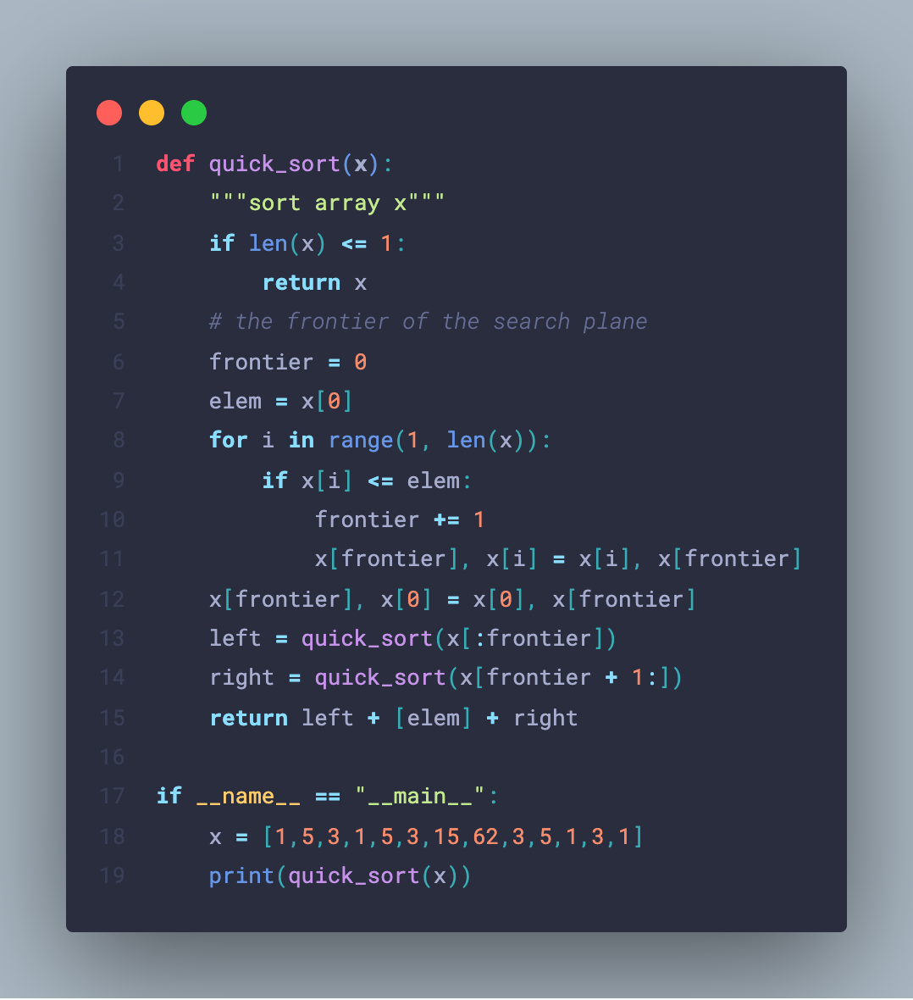
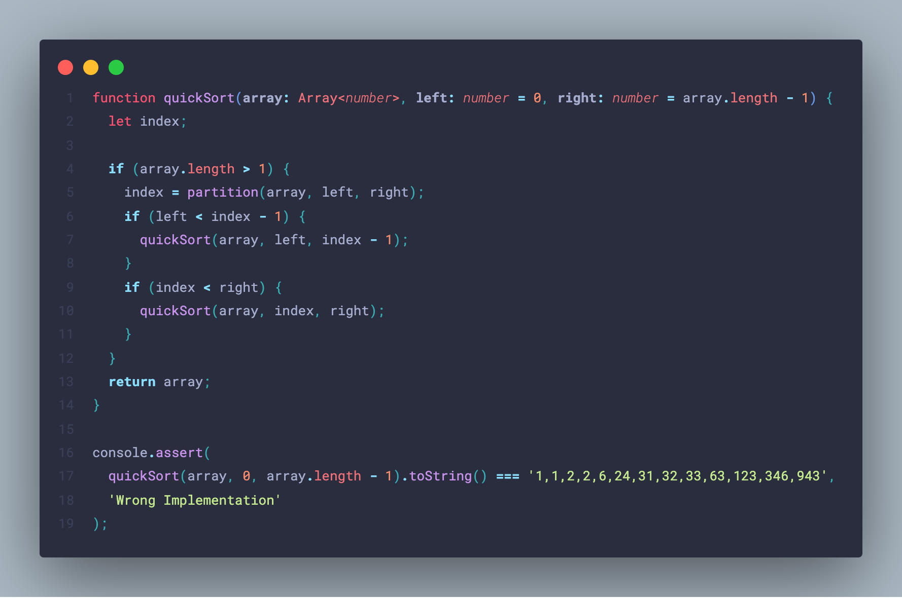
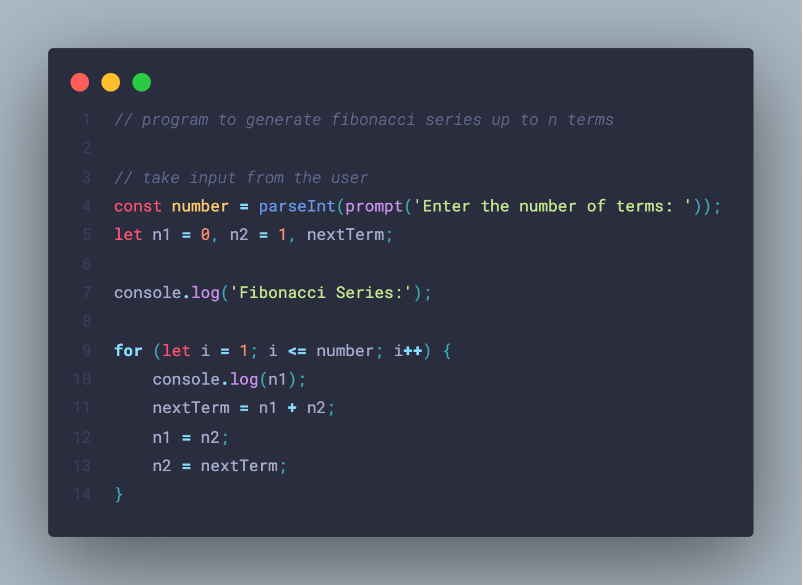

# Nocterial Palenight

*logo by Eric Dauenhauer. Check out his other generative art and cool pieces at https://ericyd.com/generative-art/*
## TL,DR
This theme takes Noctis syntax highlighting and replaces color scheme with Material Palenight. A bit of added personal flair as well and color scheme is tuned for python. Enjoy!

## Sample Images
Python

Typescript

Javascript

## Description
I have been running with [Noctis Uva](https://github.com/liviuschera/noctis#noctis-uva) theme by Liviu Schera for a while now and I think it is just about the perfect theme for me, but I kept coming back to the sweet color palette of [Material Palenight](https://github.com/material-theme/vsc-material-theme) by Mattia Astorino. I wanted the best of both worlds! So I stole the syntax highlighting from Noctis and replaced the color scheme with the colors of Material Palenight. I think it looks good!

## 👍 For Best Experience 👍
Install [Material Icon Theme](https://github.com/material-theme/vsc-material-theme-icons) and [Material Theme](https://github.com/material-theme/vsc-material-theme) first. Set the theme to **Material Palenight**, then `cmd-shift-p` or `ctrl-shift-p` to get command palette and select `Material Them Icons: Fix icons accent. Basec on Material Theme`. This will make the icons looks sweet. Then switch back to Nocterial Palenight theme.
